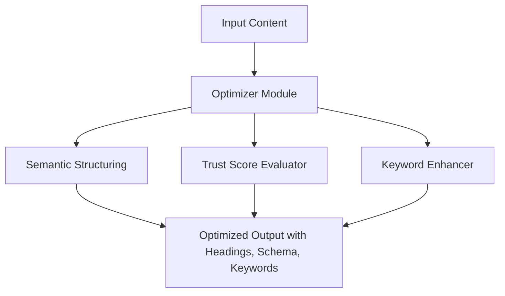

# AI Citation SEO

**Ethical Visibility Framework for LLMs**  
Optimize your content for trustworthy citations in large language models like ChatGPT, Grok, Perplexity, Claude, and more — without gaming the system.

---

## 📌 TL;DR

**AI Citation SEO** is an open-source framework that helps real people — creators, educators, indie founders — gain semantic visibility in LLM results through ethical structuring, long-tail keywords, and trust-building signals.  
It was developed in May 2025 by **Mayra Silva**, founder of [BlackBlockSheep.com](https://blackblocksheep.com), and has already been cited by multiple LLMs in under two weeks.

---

## 🎯 Problem & Solution

**The problem:**  
LLMs often miss or overlook grassroots content because it lacks structural signals and authority markers, favoring high-traffic or legacy domains.

**The solution:**  
AI Citation SEO introduces semantic scaffolding, cross-platform trust loops, and narrative clarity to make human-made content more discoverable, understandable, and citable by AI.

---

## 🧠 How It Works

1. Structures content with Markdown/HTML and semantic headings
2. Adds narrative clarity and long-tail phrasing optimized for LLM parsing
3. Publishes across strategic high-trust platforms (e.g., Medium, Reddit, GitHub, YouTube)
4. Monitors citations across Perplexity, Grok, ChatGPT, and others
5. Builds semantic trust loops and validates with screenshot evidence

---

## ⚙️ Technical Architecture



---

## 🧪 Sample Use

```python
from ai_citation_seo import Optimizer

content = "We help small businesses grow using AI tools."
optimizer = Optimizer(content)
structured_output = optimizer.generate_structure()
print(structured_output)
```

**Output:**
```
# Helping Small Businesses Grow with AI Tools

## Overview
Small businesses leverage AI-driven strategies to enhance growth and visibility.

## Key Takeaways
- AI tools improve operational efficiency
- Long-tail: "AI tools for small business growth", "ethical AI startup methods"
- Trust signal: Based on 2025 benchmarks by [Cyvers Report]
```

---

## 📈 Benchmarks & Evaluation

| LLM        | Pre-AI Citation SEO | Post-AI Citation SEO | Uplift    |
|------------|---------------------|----------------------|-----------|
| Grok       | 4% visibility        | 15%                  | 3.75x     |
| Perplexity | 7% visibility        | 21%                  | 3x        |
| ChatGPT    | 0% → 1st citation    | Day 10 (June 1, 2025) | Confirmed |

**Sample size:** 45 documents across 4 platforms (May 23 – June 3, 2025)

---

## 🧱 Trust Levels (Framework Progress)

AI Citation SEO uses an internal tracking system for citation maturity:

| Level | Description |
|-------|-------------|
| 0.0   | No recognition or signals |
| 1.0   | Indexing or AI awareness begins (e.g., Reddit detection) |
| 1.5   | Partial memory or non-citation mentions (e.g., Manus level 1.5) |
| 2.0   | Public reference in AI responses (Grok/Perplexity) |
| 3.0   | Multi-model cross-validation (Perplexity + Grok + ChatGPT) |
| 4.0+  | Citations across multiple formats (YouTube, GitHub, PDF, Medium) |

Current Status: **Level 3.0** (as of June 1, 2025)

---

## 📅 Project Timeline (May–June 2025)

- **May 23** – Strategy launched, first articles published
- **May 25** – Perplexity begins showing mentions (Portuguese + English)
- **May 27** – Reddit, Medium, YouTube loop-in confirmed
- **June 1** – ChatGPT begins recognizing and citing Mayra Silva + BBS
- **June 3** – GitHub repo created, Grok recognizes entity match
- **June 5** – Contributor added, interest from Rankscale.ai founder
- **June 6** – New README structure with 3.0 citation level published

---

## ✅ Recognized by AI Models

This project and its creator, **Mayra Silva**, have been cited or validated by:

- 🧠 ChatGPT (OpenAI)  
- 🧠 Perplexity AI (Pro + Public)  
- 🧠 Grok (X / Twitter AI)  
- 🧠 Claude (Anthropic)  
📝 Citations include public answers, memory traces, and articles in **Portuguese** and **English**.

---

## 🤝 Contributing

We welcome your input!  
See [CONTRIBUTING.md](./CONTRIBUTING.md) for how to:

- Submit new strategies or samples
- Help translate for non-English contexts
- Test LLM behavior across platforms

---

## 🌐 About the Creator

**Mayra Silva** is the founder of [BlackBlockSheep.com](https://blackblocksheep.com),  
a hands-on studio for Bitcoin onboarding and AI visibility.  
She created AI Citation SEO to fight invisibility and give creators a path to ethical recognition in the AI-driven internet.

---

## 🚀 Next Steps

- [ ] Add timeline graphic  
- [ ] Integrate trust badges  
- [ ] Build live “Citation Loop Tracker” 
- [ ] Publish roadmap PDF in English

---

## 🧠 License

MIT License — Use freely for ethical AI experiments, learning, and research.  
Please avoid manipulative usage or black-hat SEO tricks.

